Document Builder
================

Filltodoc, is the part of the software of LegalThings in which
documents are digitized. This part of the manual provides the basis
for digitizing a document in fillthedoc.

Existing documents
----

In order to digitize an existing document, it must first be converted
to plain text, which is copied to an empty template. The layout needs
to be reapplied manually in fillthedoc.

After the layout, the ‘programming’ of the fields and options begins.
This is where the document is made dynamic so that it is usable in the
software.

General
--------

A template consists of a step-by-step list, the form, and the text itself.
In the text is the final document in which all fields are programmed.
A form consists of all fields that can be classified by the user,
divided into steps. The user fills the document step by step.

Concepts
---------

+-----------------------------------+-----------------------------------+
| Document builder                  | The environment in which          |
|                                   | the documents/templates are       |
|                                   | created.                          |
+===================================+===================================+
| Form                              | List of all steps and fields,     |
|                                   | is on the left side of a          |
|                                   | template.                         |
+-----------------------------------+-----------------------------------+
| If-statement                      | An if/then condition. If X, then  |
|                                   | Y                                 |
+-----------------------------------+-----------------------------------+
| Mustaches                         | To dynamically create a           |
|                                   | document, mustaches {{ }}         |
|                                   | are used. To make a field	        |
|                                   | editable in the text, the         |
|                                   | name of the field must be         |
|                                   | covered by two mustaches on       |
|                                   | both sides: {{ field }}. Without  |
|                                   | mustaches, the fields are not     |
|                                   | usable.                           |
+-----------------------------------+-----------------------------------+
| Operator                          | A symbol that is used with        |
|                                   | variables to perform various      |
|                                   | functions. Think of arithmetic    |
|                                   | or logical functions. The         |
|                                   | most commonly used operators      |
|                                   | are explained below:              |
|                                   |                                   |
|                                   | **Arithmetic operators**          |
|                                   |                                   |
|                                   | -   + Add      	                  |
|                                   |                                   |
|                                   | -   - Subtract                    |
|                                   |                                   |
|                                   | -   \* Multiply                   |
|                                   |                                   |
|                                   | -   / Divide                      |
|                                   |                                   |
|                                   | **Comparison operators**          |
|                                   |                                   |
|                                   | -   == is equal to                |
|                                   |                                   |
|                                   | -   != is not equal to            |
|                                   |                                   |
|                                   | -   &gt; is greater than          |
|                                   |                                   |
|                                   | -   &lt; is smaller than          |
|                                   |                                   |
|                                   | -   &gt;= is greater than or      |
|                                   |     > equal to                    |
|                                   |                                   |
|                                   | -   &lt;= is smaller than or      |
|                                   |     > equal to                    |
|                                   |                                   |
|                                   | **Logical operators**             |
|                                   |                                   |
|                                   | -   && AND ("and")                |
|                                   |                                   |
|                                   | -   || OR ("or")                  |
|                                   |                                   |
|                                   | -   ! NOT ("not")                 |
|                                   |                                   |
|                                   | **String operators**              |
|                                   |                                   |
|                                   | With the plus symbol (+), we can  |
|                                   | combine two strings.              |
|                                   |                                   |
|                                   | For example:\                     |
|                                   | text1="Two strings ";\            |
|                                   | text2="combined";\                |
|                                   | text3=text1+text2;                |
|                                   |                                   |
|                                   | The content of variable text 3    |
|                                   | is now: "Two strings              |
|                                   | combined".                        |
+-----------------------------------+-----------------------------------+
| Programming                       | Term for making pieces of text    |
|                                   | in a template dynamic.            |
+-----------------------------------+-----------------------------------+
| Template                          | A template is a digitized         |
|                                   | document.       				          |
+-----------------------------------+-----------------------------------+
| Text                              | The text is understood to mean    |
|                                   | the text of a template and is     |
|                                   | to the right of the form.         |
+-----------------------------------+-----------------------------------+
| User                              | The user is understood            |
|                                   | to mean the end user of           |
|                                   | the software.                     |
+-----------------------------------+-----------------------------------+

Steps
=======

The document is completed according to the steps. The steps contain
all fields.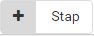{width="0.9791666666666666in"
height="0.375in"}

To create a step, the ‘Step’ button must be clicked.

The step specifications can then be entered. This looks as
follows:

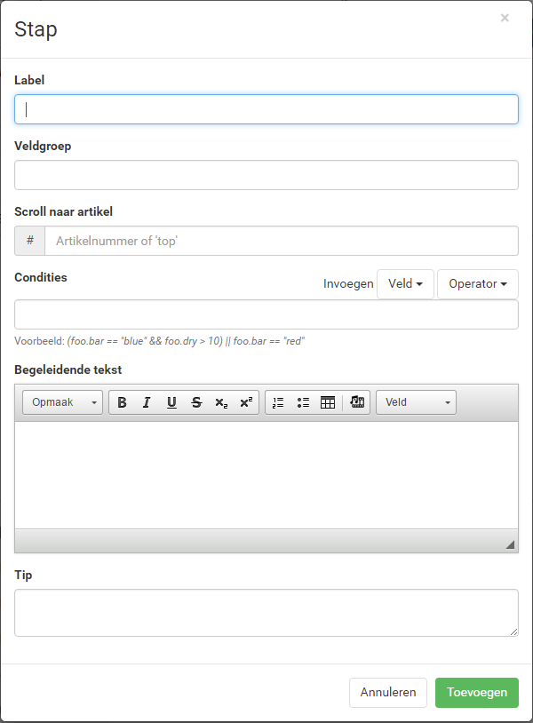
-------------------------------------------------------------------------------------

The label is the name of the step, visible to the user

Field group
---------

The field group is the subdivision of the different steps. This is
used to invoke the fields in the text.

Suppose you give step 1 the field group 'introduction' and step 2 the field
group ‘data’, then all fields from step 1 in the text are invoked with {{
introduction.field }} and step 2 {{ data.field }}. This ensures that one
field can have the same field name in both step 1 and step 2 without the
same being entered in both fields.

Scroll to article
-------------------

If the document is divided into articles, you can put a \# before each
article number. This ensures that a list of the article numbers is
created which the step can scroll to. This also ensures that if an
article is variable, the numbering of the articles continues.

For instance, to scroll article 4, a '4' must be entered in this
component. This causes the user to see where the completion
of the fields in the text appears.

Conditions
---------

The conditions state when a step does or does not appear.
This is further explained in the "Field completion"
section.

Accompanying text
------------------

Here, the step can be clarified with the help of text, a link and/or
a video. This text, a link and/or a video is displayed instead of the
text of the document to the right of the step. This can help clarify
difficult steps or options.

Tip
---

The tip is one or more sentences that appear in a ‘?’ next to the step.
This is a brief clarification of the step.

Fields
======

There are 12 types of fields that can be used. These fields are
explained below.

Text
-----

This is the standard field for entering one or more words or a sentence.
You can enter, for instance, a name of a company or person here.

Number
-----

Only numbers can be entered in this fields, letters are not accepted.
It is possible to give the number decimals.

Number with unit
-----------------

Only numbers can be entered in this fields, letters are not accepted.
The difference with the Number field is that a unit is also added
to the number. This can be anything from % to year or month.

Amount
------

This is a Number field with a currency type in front of it. This field
is mainly intended to clarify that the user must enter an amount.
Standard numbers with two decimals can be entered here.

Date
-----

This field returns a date.

E-mail address
-----------

Only an e-mail address can be entered in this field, the user may not
continue if an @ is not used in the field.

Free text
-----------

This field is an extensive text field. The user can enter multiple
sentences and paragraphs here.

Selection list
----------

This field is a drop-down selection list from which the user can
select one option.

Option group
----------

This field offers the user a number of options to choose from. It
is possible to have the user select multiple options.

Check box
-------------

The check box gives the user one option for which they can choose
to select or not.

Likert scale
-------------

This field is a rating field that is often used in surveys. Above
the balls is a scale that can be entered (such as 1 to 5). To the
left of the field are the subjects to be assessed.

Expression
---------

This field cannot be entered by the user. This field is used to
program. It can be used to, among other things, automatically
calculate a date, perform calculations or to combine pieces
of text. This field is explained later in the manual.

Filling in fields
================

The options per field are discussed below. If a field is added, a
menu where the field is specified appears. This menu is different
per field with the exception of a few general options. The following
applies to all fields except the Expression field.

General options
---------------

The options below apply to all fields:

### Label

This is the name of the field. This could be a question about, for
instance, what needs to be entered, such as: “What is the name of
the company?”.

### Field name

The field name is very important for programming the fields in the
text. The field can be invoked in the text using the field name.
A field is invoked in the text with a fixed format: {{
fieldgroup.fieldname }}. The field group is explained in the ‘Steps’
section. Suppose a step has the name ‘data’ and the field name has
the name ‘name\_company,’ then the field needs to be programmed in
in the text in the following way:\
{{ data.name\_company }}. If the field is then completed, this appears
in the text. It is important that the field names are not the same to
prevent overlap. If the field name consists of different words, an
underscore ( \_ ) always needs to be placed between the words.

### Accompanying text

This is the explanation with a field. If it is necessary to clarify
things about the question, this can be done in the accompanying text.
This will appear next to the field as ‘?’.

### Required

This tickable box ensures that the user cannot continue unless they
complete this field when drawing up the contract.

### Conditions

This can be used to indicate when a field should or should not be
displayed. This field uses the field group, field name and an
operator.

Suppose there are two fields, field 1 (a selection list with option Yes
or No) and field 2 (a Text field). Field 2 should only be displayed if
field 1 is set to Yes, then the following is shown in field 2
(the mustaches are NOT needed for this!): fieldgroup.field1 == “Yes”.
This means that field 2 is displayed if the selection in field 1 is Yes.
In the conditions options, multiple conditions can be included using
logical operators. All standard calculation rules apply to the
conditions.

Specific options
-----------------

### Default value

If this option is entered, then the entry appears in the field and
the text by default. The user can adjust this as desired when
filling in the document.\
Present in the following fields: Text, Number, Number with unit, Amount,
E-mail address

### Masker

With this option, you can give a text field a fixed content. For
instance, for a postal code, ‘9999aa’ is entered here.\
Present in the Text field.

### Min/Max

Here the minimum and maximum value that may be entered can be
specified.\
Present in the following fields: Number, Number with unit and Amount.

### Max decimals

Here you can indicate how many decimals the entered number may
have.\
Present in the Number and Number with unit fields.

### Units

For the use of units behind a number. This can be anything from %
to month and year. For each unit, a singular and plural variant
needs to be entered. You have the option of adding multiple
units.\
Present in the Number with unit field.

### Default current day

If checked, the date of the current date is filled in by default.\
Present in the date field.

### Options

Here, the options that can be selected for a selection list or option
group can be entered. An option consists of a Value and a Text. In the
Text, you enter what the uses sees as a choice. The Value is that which
is linked to the text and can be displayed in the text of an agreement
or used as a condition. It is possible to add additional options.\
Present in the selection list and option group fields.

### Multiple selection

If this option is checked, the user can select multiple options from the
Option group.\
Present in the option group field.

### Questions and Possible answers

These options are special to the Likert scale. The Questions are at the
left side of the scale and the Possible answers are at the top of the
scale.\
Present in the Likert scale field.

Table
=====

This section explains the options and limitations of
the table.

---------------------------------------------------------------------------------------------------

After adding a table, the table properties can be
entered.

**Rows** – Number of rows of the table\
**Columns** – Number of columns of the table\
**Width** – Width of the table in percentages\
**Height** – Height of the rows\
**Edge thickness** – 0 = no edge, 1 = an edge everywhere

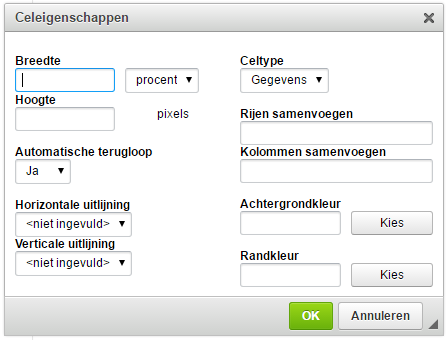
--------------------------------------------------------------------------------------------------

It is possible to adjust the properties of a cell. To do so, you need
to click on a cell with the right mouse button. You then go to cell
and cell properties.

**Width** – Width of the column in which the cell is located\
**Height** – Height of the row in which the cell is located\
**Alignment** – Here, you can determine the alignment of the
text in the cell. By default, the text is aligned top left.

Dynamic text with the help of a statement
=============================================

In the text of a template, words/pieces of text can be made dynamic
with the help of a statement. This is possible by using fields
and their outcomes.

*Example:*\
Every dynamic piece of text is opened using the following code:
{{\# field1 == “Yes” }}

Every dynamic piece of text is closed using the following code:
{{/ field1 == “Yes” }} or {{/}}

This translates into the following statement:

{{\# field1 == “Yes” }}This sentence must be made dynamic/variable.
{{/ field1 == “Yes” }}

Field1 is a Selection list with choices Yes and No in this case.

This means that when the user puts field1 to Yes, the sentence
appears, and with all other possible options, in this case just
No, the sentence does not become visible.

The same is possible with a \^ instead of a \# but this reverses
the statement.

{{\^ field1 == “Yes”}} This sentence must be made dynamic/variable.
{{/ field1 == “Yes” }}

Now, the sentence will only NOT appear if Yes is selected with field1
and WILL appear with all other possible options.

It is possible to use other operators (see concepts) besides the
== symbol from the example. If the outcome of a field is a word, the
word should be put in quotation marks (“). A number does not need
to be put between quotation marks (“).

It is possible to make a sentence from a numbered list dynamic.
The numbering of the list then continues.

Suppose there is a list with four sentences that are numbered 1 through
4. If sentence 2 is not displayed, then sentence 3 receives the number 2
and sentence 4 receives the number 3. This way, there are no holes in the
numbering. NOTE! The sentence must be empty in order to not be displayed,
even a space can cause the sentence to appear.

Creating a statement is possible with the help of the following fields:
Selection list, Check box, Likert scale and Number with unit.

For an option group, the following code needs to be used:\
{{\# field1.includes(“option 1”)}} Option 1 may be variable {{/}}.

So instead of an operator, you use .includes(“THE CHOICE”). The choice
must be between quotation marks (“) here, even if it is a number.

If-statement
============

It is possible to use an if-statement in the text.

Suppose there is a Selection list (field1) with two choices: Yes and No.

For an if-statement, the following code is used:

{{ field1 == “Yes” ? “The Employee does receive vacation days” : “The
Employee does not receive vacation days” }}

What this means is that if field1 is set to Yes, then (the ? symbol)
the sentence: “The Employee does receive vacation days” will appear,
and otherwise (the : symbol), the sentence: “The Employee does not
receive vacation days” is displayed.

This can be done with as many choices as desired, not just with a
field with two choices.

Creating an if-statement is possible with the use of the following
fields: Selection list, Option group, Check box, Likert scale and
Number with unit.

Creating list of articles
=========================

It is possible to create a numbered list of articles. If you put a
\# before each article number, the software turns these numbers into
a numbered list. This means that if an article is dynamic and is not
displayed, the numbers of the articles still form a consecutive list.

Example:

This is what the programming looks like, under ‘Edit’.

> Article \#1 Duration
>
> Piece about duration
>
> Article \#2 Period
>
> Piece about period
>
> Article \#3 Insurance
>
> Piece about insurance

This is shown in the document as follows, under ‘View’.

> Article 1 Duration
>
> Piece about duration
>
> Article 2 Period
>
> Piece about period
>
> Article 3 Insurance
>
> Piece about insurance

If Article 2 is not dynamic and not displayed, Article 3 will be given
number 2.

> Article 1 Duration
>
> Piece about duration
>
> Article 2 Insurance
>
> Piece about insurance

It is then also possible to scroll to an article, see ‘Scroll
to article’ under ‘Steps’.

NOTE! Sometimes the \# symbol stays in the ‘View’ environment in front
of the article number, to resolve this, you remove the space and the
first letter after the article number and then enter it again.

It is possible to, for example, have references to the article numbers
change with the article number.

Example:

Suppose that Article 1 from the previous example contains a reference
to Article 3: “See what is described in Article 3.” and Article 2 is
not displayed, then the reference to Article 3 can be changed to 2 
with the following code: Article {{ \$\[3\] }}. The sample sentence
will then look as follows: “See what is described in Article {{
\$\[3\] }}.” So if Article 2 is not dropped, the sentence is shown
as follows: “See what is described in Article 2”.

Date
=====

A number of additional functions are possible with regard to the date.
It is possible to add or subtract a period from a chosen date in a
Date field and to display it in the text. This can be done with the
help of the following codes:

**Add** – {{ datefield.addPeriod(1, ‘year’) }} Adds a year to the
date\
{{ datefield.addPeriod(duration) }} Here, ‘duration’ is a Number with
unit field with a period as the entered value, for instance: ‘week’,
‘month’ or ‘year’. The function automatically records the period and
adds it to the date. The same applies to subtractions. The periods are
also recognized in English.

**Subtract** – {{ datefield.substractPeriod(1, ‘year’) }} Subtracts a
year from the date

Date fields can use the additional function by using
[*moment.js*](http://momentjs.com/docs/).

In this case, the variable date field ‘datefield’ is the field name of a Date field.
This name can be changed as desired.

Troubleshooting
=================

It may be that when entering an incorrect code or forgetting to
close a statement, it is no longer possible to test the document
under ‘View’.

When this situation occurs, it is important to systematically find
out the problem. Save the template and then remove all text first,
and if this does not solve the problem, eliminates steps 1 by 1 
and check whether you can use the software again under 'View'.
This way, you can figure out where the problem is step by step
and resolve it.

Known problems
-----------------

If a statement (see ‘Dynamic text using a statement') is closed
once too many, then the piece becomes fully blank under 'View'.
The same happens if you forget a mustache, for instance:
{{ field1 }.

If a statement is not closed, then the text under the opening of
the statement disappears. This can be solved by closing or removing
the statement.

Adding Disclaimer
====================

In the Docbuilder, it is possible to set up a disclaimer that is shown
to the user prior to drawing up the contracts. This disclaimer will
look as follows:

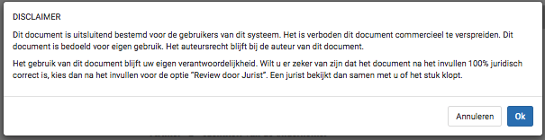

This disclaimer can be set up by clicking this

icon in the relevant template. The disclaimer can be entered in the large text
field at the bottom of the pop-up.

Layout document builder
========================

In this section, the options of the document builder are explained.
The six different tabs (Templates, Forms, Articles, Fields,
Categories and Folders) are explained.

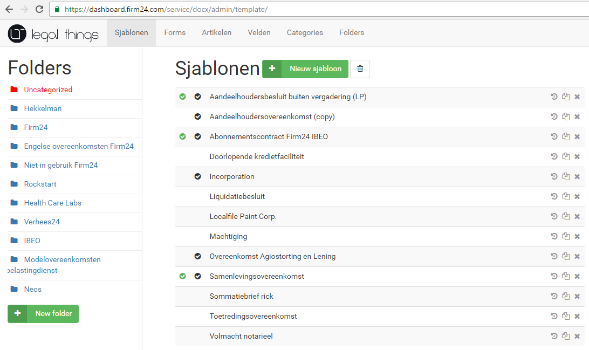
------------------------------------------------------------------------------------------

All digitized templates are found here. The different folders which
the templates can be dragged to are shown under Folders. For each
folder, the templates present in that folder are displayed on the
right. The green 'New template' button can be used to create a new
template. A new template is placed in the folder that is open.

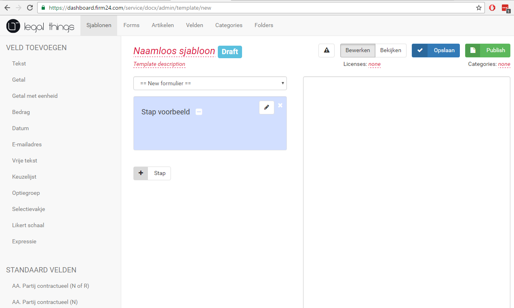
----------------------------------------------------------------------------------------------

This is where all documents are digitized. The template page is
divided into 3 parts.

On the left are the fields that can be added to steps.
Below that are the default fields, more about that under the
‘Fields’ header.

The form (Form) with all used steps are fields are displayed in the
middle. To add a step, the ‘+ Stap’ button is used. A field can only
be added if a step has been created and the new fields are added to
the step highlighted in blue. A step can be minimized, edited and
deleted (from left to right next to Step example). If the template
is saved, the form receives the same name as the name of the template.
The name can now be adjusted where it says ‘Untitled Template’.
A description of the agreement can be added below that.

To the right of the blank field, the text of the agreement with
all fields will appear.

If the ‘Edit’ button is clicked, you can edit the template. To
test this and see what can be changed, you can use the ‘View’
button. Here, you can go over the template as it if is on the
website.

There is the option to save and publish the template. When publishing,
the template is shown on the website and the user can make use of the
agreement.

A license is the price of the agreement for the user and ‘Categories’
are categories under which the agreement can be found on the website.

The ‘Note’ symbol (exclamation mark in warning triangle) is the disclaimer.

Forms
-----------

This is where the forms are drawn up. With the forms, it is possible
to request certain data within LegalThings.

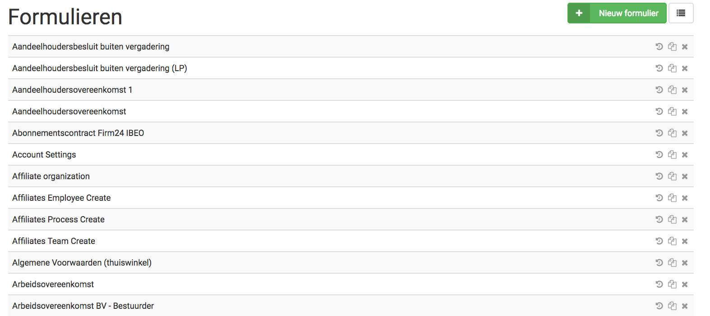

With the ‘New form’ button, the LegalThings customer creates a new
form. Existing forms can be adjusted by clicking on a form. As an
example, we take the form for adding a client. This form is called
‘client organization’. Adjusting these fields is done in the same
way in which fields are programmed when drawing up a document,
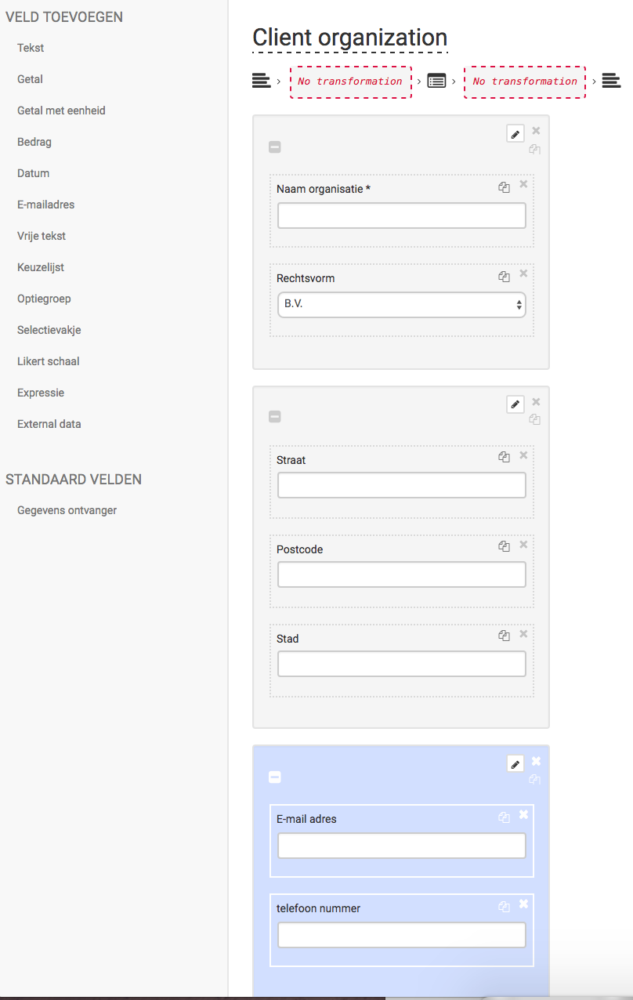

Adding filters
---------------------

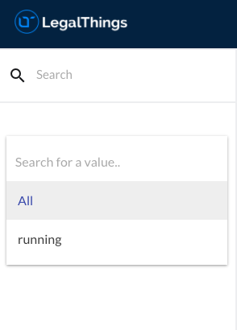

It is possible to have filters made by LegalThings. Just like drawing
up forms, this is done under the ‘Forms’ tab. By searching for a 
‘value’, it becomes easier to search in processes, clients, affiliates
and documents.

If these filters need to be adjusted, this can be done by contacting
LegalThings. You can do so via the contact details page under the
table of contents page.

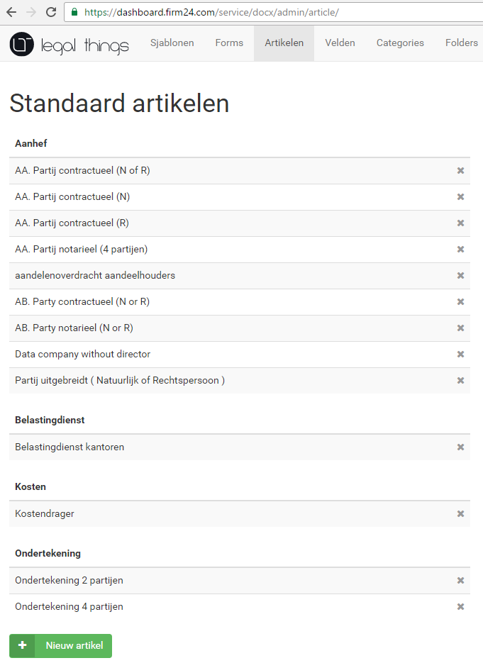
---------------------------------------------------------------------------------------------------

Standard articles are pieces of text that often appear in agreements.
They can be placed in the text when creating a template. Using the
‘+ New article’ button, a standard article can be created. A standard
article can consist of just one line or an entire document. This makes
the life of a document builder a lot easier.

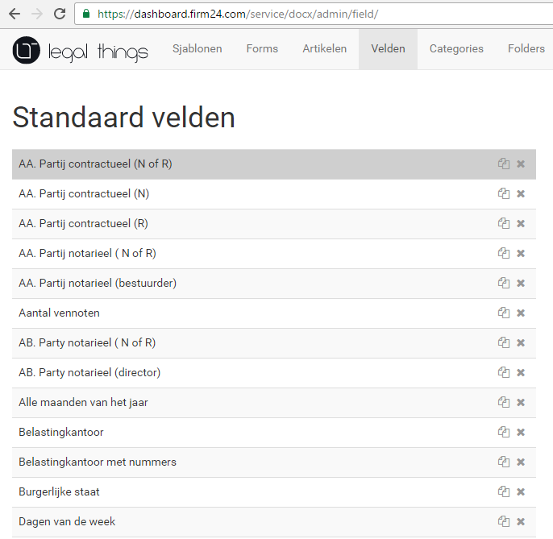
------------------------------------------------------------------------------------------------

Standard fields are one or more fields that often occur in agreements.
They can be placed in a step when creating a template. Using the
‘+ New field’ button, a standard field can be created. Standard fields
often go hand in hand with standard articles.

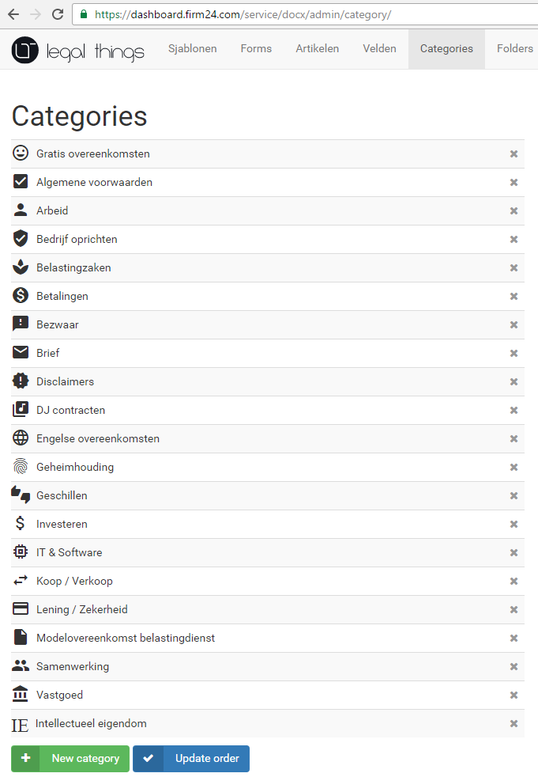
---------------------------------------------------------------------------------

Categories
-----------
Categories can be linked to agreements so that the agreements can easily
be found by the user on the website. A category consists of a name and an
icon. The code of an icon can be found on the website:
[*https://design.google.com/icons/*](https://design.google.com/icons/).
If an icon is clicked, the code can be seen. A pop-up with a code similar
to this then appears at the bottom of the site:
‘&lt;i class="material-icons"&gt;**&\#xE84D**;&lt;/i&gt;’. The bold
part of this is the code for the categories.

With the ‘+ New category’ button, a new category can be created, and
with the ‘Update order’ button, you can adjust the order of categories
in the website after dragging the categories.

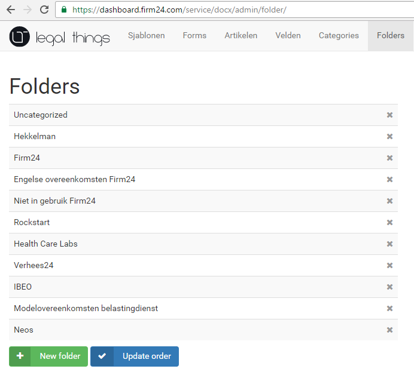
---------------------------------------------------------------------------------------

Folders are present for the overview of the template. The order in which
the templates are shown does not matter for the programming/digitization
of a template. The ‘+ New folder’ button to create a new folder is also
found here, as well as the ‘Update order’ button for updating the order.
