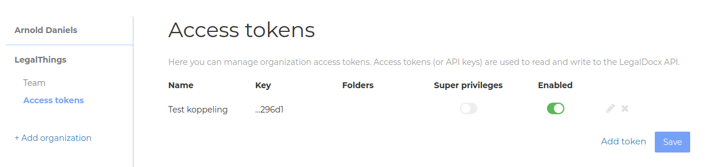
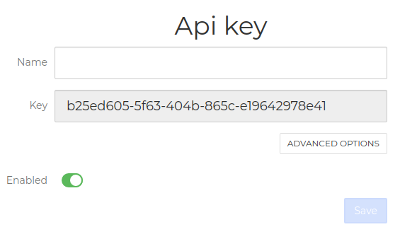
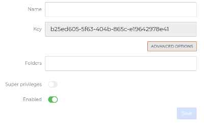

# API

## Authentication header

The API uses bearer authentication. Add the following header to each API HTTP request;

```text
Authorization: Bearer {KEY}
```

_\(replace `{KEY}` with your access token API key\)_

## Creating an access token

Access tokens _\(aka API keys\)_ can be created and managed via account settings.



Press `Add token` to create a new token. When adding a token, specify a name that reflects what the token will be used for.



Copy the value of the `Key` field, which is uses for the authentication. Beware that the key is only displayed when creating an access token. If you loose this value, simply remove the token and create a new one.



Under `Advanced options` you can limit a key to specific folders. By default a key can access templates from any folder.

It's also possible to give a key super privileges, which allows you to create access tokens via the API. This is generally not recommended.

