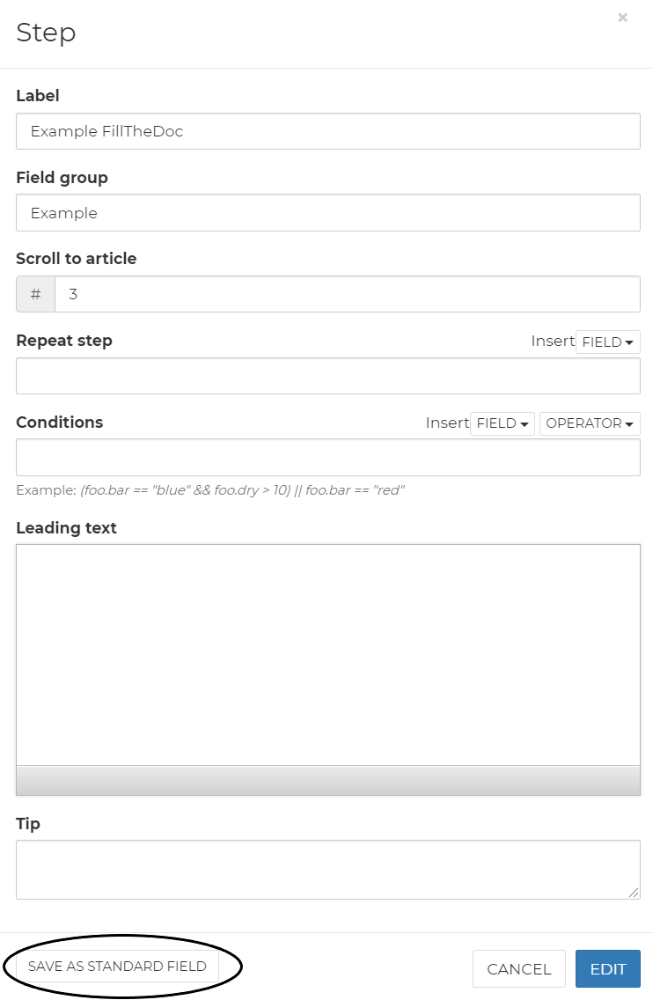

# FillTheDoc UI

## Templates

Described in &lt;Templates&gt;

## Standard texts

You can create standard texts sorted in different groups. Standard texts can be as short as one line and as long as a complete document. You can insert these standard texts in your templates.

## Fields

Standard fields are one or more fields that you often use in your templates. You can place them in a step of your template. A new standard field can be made by clicking on the green 'new field' button or by saving  a step/field in your template as standard field. 

## Headers / Footers

You can create standard Headers and Footers for your templates. A new Header / Footer design can be created by clicking on the green 'new section' button. 

The design won't show up in the template itself but will be shown in the final document. You can drag a text or image field in the header/footer section and design in to your liking.

