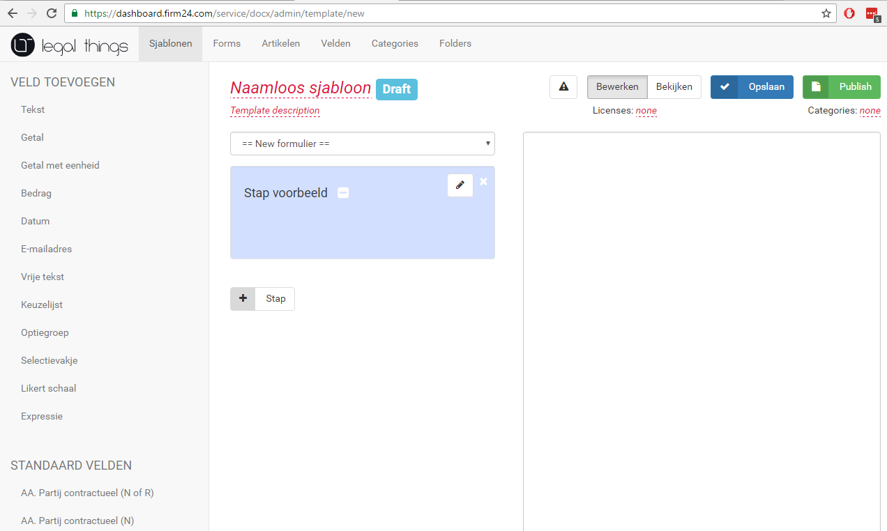
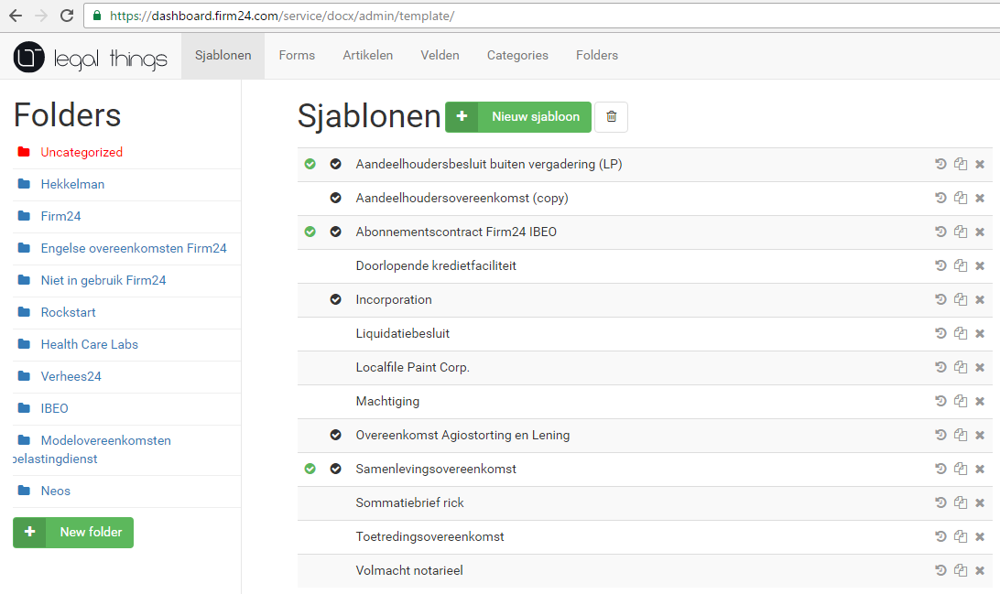

# Templates

## Creating a new template

Press the green 'New template' button to create a new template. It will open a new page.

### 

This is where all documents are digitized. The template page is divided into 3 parts.

On the left are the fields that can be added to steps. Below that are the default fields, more about that under the ‘Fields’ header.

The form \(Form\) with all used steps are fields are displayed in the middle. To add a step, the ‘+ Stap’ button is used. A field can only be added if a step has been created and the new fields are added to the step highlighted in blue. A step can be minimized, edited and deleted \(from left to right next to Step example\). If the template is saved, the form receives the same name as the name of the template. The name can now be adjusted where it says ‘Untitled Template’. A description of the agreement can be added below that.

To the right of the blank field, the text of the agreement with all fields will appear.

If the ‘Edit’ button is clicked, you can edit the template. To test this and see what can be changed, you can use the ‘View’ button. Here, you can go over the template as it if is on the website.

There is the option to save and publish the template. When publishing, the template is shown on the website and the user can make use of the agreement.

A license is the price of the agreement for the user and ‘Categories’ are categories under which the agreement can be found on the website.

The ‘Note’ symbol \(exclamation mark in warning triangle\) is the disclaimer.

## Folders

### 

Templates can be organized in folders. Folders are nested; each folder may have subfolders.

The different folders which the templates can be dragged to are shown under Folders. For each folder, the templates present in that folder are displayed on the right. The green 'New template' button can be used to create a new template. A new template is placed in the folder that is open.

## Using an existing document as template

In order to digitize an existing document, it must first be converted to plain text, which is copied to an empty template. The layout needs to be reapplied manually in fillthedoc.

After the layout, the ‘programming’ of the fields and options begins. This is where the document is made dynamic so that it is usable in the software.

