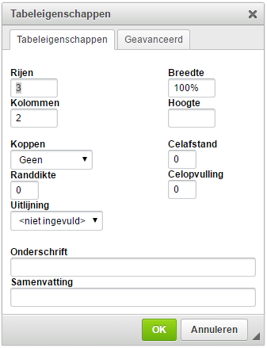

# Content

## Table

This section explains the options and limitations of the table.

### 

After adding a table, the table properties can be entered.

**Rows** – Number of rows of the table **Columns** – Number of columns of the table **Width** – Width of the table in percentages **Height** – Height of the rows **Edge thickness** – 0 = no edge, 1 = an edge everywhere

### 

It is possible to adjust the properties of a cell. To do so, you need to click on a cell with the right mouse button. You then go to cell and cell properties.

**Width** – Width of the column in which the cell is located **Height** – Height of the row in which the cell is located **Alignment** – Here, you can determine the alignment of the text in the cell. By default, the text is aligned top left.

## Dynamic text with the help of a statement

In the text of a template, words/pieces of text can be made dynamic with the help of a statement. This is possible by using fields and their outcomes.

_Example:_ Every dynamic piece of text is opened using the following code:

Every dynamic piece of text is closed using the following code: or

This translates into the following statement:

This sentence must be made dynamic/variable.

Field1 is a Selection list with choices Yes and No in this case.

This means that when the user puts field1 to Yes, the sentence appears, and with all other possible options, in this case just No, the sentence does not become visible.

The same is possible with a \^ instead of a \# but this reverses the statement.

This sentence must be made dynamic/variable.

Now, the sentence will only NOT appear if Yes is selected with field1 and WILL appear with all other possible options.

It is possible to use other operators \(see concepts\) besides the == symbol from the example. If the outcome of a field is a word, the word should be put in quotation marks \(“\). A number does not need to be put between quotation marks \(“\).

It is possible to make a sentence from a numbered list dynamic. The numbering of the list then continues.

Suppose there is a list with four sentences that are numbered 1 through 4. If sentence 2 is not displayed, then sentence 3 receives the number 2 and sentence 4 receives the number 3. This way, there are no holes in the numbering. NOTE! The sentence must be empty in order to not be displayed, even a space can cause the sentence to appear.

Creating a statement is possible with the help of the following fields: Selection list, Check box, Likert scale and Number with unit.

For an option group, the following code needs to be used: Option 1 may be variable .

So instead of an operator, you use .includes\(“THE CHOICE”\). The choice must be between quotation marks \(“\) here, even if it is a number.

## If-statement

It is possible to use an if-statement in the text.

Suppose there is a Selection list \(field1\) with two choices: Yes and No.

For an if-statement, the following code is used:

What this means is that if field1 is set to Yes, then \(the ? symbol\) the sentence: “The Employee does receive vacation days” will appear, and otherwise \(the : symbol\), the sentence: “The Employee does not receive vacation days” is displayed.

This can be done with as many choices as desired, not just with a field with two choices.

Creating an if-statement is possible with the use of the following fields: Selection list, Option group, Check box, Likert scale and Number with unit.

## Creating list of articles

It is possible to create a numbered list of articles. If you put a \# before each article number, the software turns these numbers into a numbered list. This means that if an article is dynamic and is not displayed, the numbers of the articles still form a consecutive list.

Example:

This is what the programming looks like, under ‘Edit’.

> Article \#1 Duration
>
> Piece about duration
>
> Article \#2 Period
>
> Piece about period
>
> Article \#3 Insurance
>
> Piece about insurance

This is shown in the document as follows, under ‘View’.

> Article 1 Duration
>
> Piece about duration
>
> Article 2 Period
>
> Piece about period
>
> Article 3 Insurance
>
> Piece about insurance

If Article 2 is not dynamic and not displayed, Article 3 will be given number 2.

> Article 1 Duration
>
> Piece about duration
>
> Article 2 Insurance
>
> Piece about insurance

It is then also possible to scroll to an article, see ‘Scroll to article’ under ‘Steps’.

NOTE! Sometimes the \# symbol stays in the ‘View’ environment in front of the article number, to resolve this, you remove the space and the first letter after the article number and then enter it again.

It is possible to, for example, have references to the article numbers change with the article number.

Example:

Suppose that Article 1 from the previous example contains a reference to Article 3: “See what is described in Article 3.” and Article 2 is not displayed, then the reference to Article 3 can be changed to 2 with the following code: Article . The sample sentence will then look as follows: “See what is described in Article .” So if Article 2 is not dropped, the sentence is shown as follows: “See what is described in Article 2”.

## Date

A number of additional functions are possible with regard to the date. It is possible to add or subtract a period from a chosen date in a Date field and to display it in the text. This can be done with the help of the following codes:

**Add** – Adds a year to the date Here, ‘duration’ is a Number with unit field with a period as the entered value, for instance: ‘week’, ‘month’ or ‘year’. The function automatically records the period and adds it to the date. The same applies to subtractions. The periods are also recognized in English.

**Subtract** – Subtracts a year from the date

Date fields can use the additional function by using [_moment.js_](http://momentjs.com/docs/).

In this case, the variable date field ‘datefield’ is the field name of a Date field. This name can be changed as desired.

## Standard Articles

### 

Standard articles are pieces of text that often appear in agreements. They can be placed in the text when creating a template. Using the ‘+ New article’ button, a standard article can be created. A standard article can consist of just one line or an entire document. This makes the life of a document builder a lot easier.

## Troubleshooting

It may be that when entering an incorrect code or forgetting to close a statement, it is no longer possible to test the document under ‘View’.

When this situation occurs, it is important to systematically find out the problem. Save the template and then remove all text first, and if this does not solve the problem, eliminates steps 1 by 1 and check whether you can use the software again under 'View'. This way, you can figure out where the problem is step by step and resolve it.

### Known problems

If a statement \(see ‘Dynamic text using a statement'\) is closed once too many, then the piece becomes fully blank under 'View'. The same happens if you forget a mustache, for instance: {{ field1 }.

If a statement is not closed, then the text under the opening of the statement disappears. This can be solved by closing or removing the statement.

