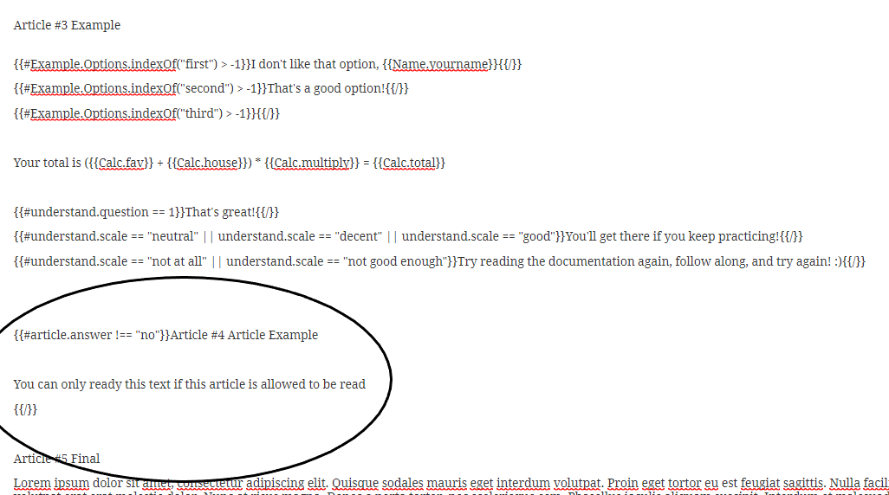

# Example

### Name and date

First, we create a step for our name 

Next, we have to drag a 'free text' field from the sidebar to this step

Now we drag a date field to the same step

Add the following text   
`The date today is {{Name.answer}}`

### Options

Now we have to create a step that's going to ask us to pick a value from a list of options

Next, we drag an option group from the sidebar to this step with the options

### Choice

Next, in case someone picks the second option, we want to know why, so we add the following field to the same step

`{{#Example.Options.indexOf("first") > -1}}I don't like that option, {{Name.yourname}}{{/}}{{#Example.Options.indexOf("second") > -1}}That's a good option!{{/}}{{#Example.Options.indexOf("third") > -1}}{{/}}`

### Calculation

We can also a calculation inside the form, and have form calculate something based on the given answers.  
First we create a calculation step with three number fields.  
We call them `Calc.fav` `Calc.house` and `Calc.multiply`

Now, we drag an expression to this step and have it multiply the sum of your favorite number with your address by a number of choice, which we call Calc.total

Under article 3, we added the following code

`Your total is ({{Calc.fav}} + {{Calc.house}}) * {{Calc.multiply}} = {{Calc.total}}`

Since we defined the articles, and we added 'scroll to article 3' in all steps, we will be shown this part of the text when someone has to answer the questions. 

### Lets add in a variable article

We're going to create a table of contents with one variable article we want to be able to take out. First we're going to create a step with a choice field. 

We want article 4 to show, unless someone answers 'no', and when it doesn't show, we want the other article numbers to automatically update, so we write the following text:`Table of contents  
Article {{$[1]}} Beginning  
Article {{$[2]}} Middle  
Article {{$[3]}} Example  
{{#article.answer !== "no"}}Article {{$[4]}} Article Example{{/}}  
Article {{$[5]}} Final`  
and we write write article 4 in the same way:

### A final check to see if we understand everything!

If someone answers no, we want to know how bad they understand it. We will use the Likert scale for that.

We add the following text:`{{#understand.question == 1}}That's great!{{/}}`

`{{#understand.scale == "neutral" || understand.scale == "decent" || understand.scale == "good"}}You'll get there if you keep practicing!{{/}}`

`{{#understand.scale == "not at all" || understand.scale == "not good enough"}}Try reading the documentation again, follow along, and try again! :){{/}}`

We now have the following text

### Lets see how our template works!

