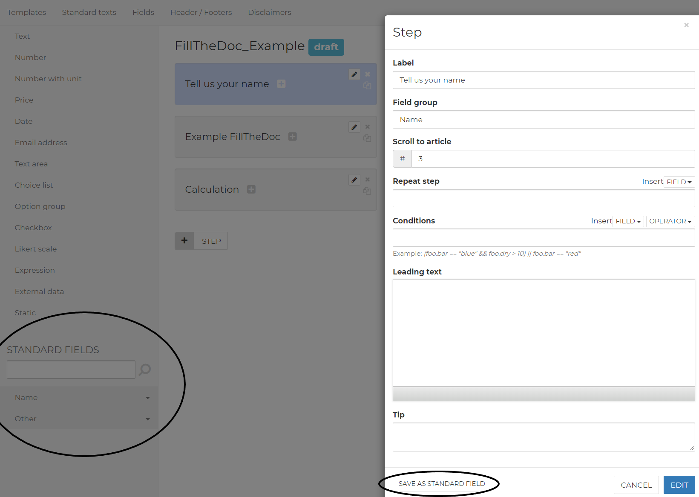

# Form

## Steps

The document is completed according to the steps. The steps contain all fields.

 To create a step, the ‘Step’ button must be clicked.

The step specifications can then be entered. This looks as follows: 

The label is the name of the step, visible to the user

### Field group

The field group is the subdivision of the different steps. This is used to invoke the fields in the text.

Suppose you give step 1 the field group 'introduction' and step 2 the field group ‘data’, then all fields from step 1 in the text are invoked with `{{introduction.date}}` and in step 2 with `{{data.field}}`. This ensures that one field can have the same field name in both step 1 and step 2 without the same being entered in both fields.

### Scroll to article

If the document is divided into articles, you can put a \# before each article number. This ensures that a list of the article numbers is created which the step can scroll to. This also ensures that if an article is variable, the numbering of the articles continues.

For instance, to scroll article 4, a '4' must be entered in this component. This causes the user to see where the completion of the fields in the text appears.

### Conditions

The conditions state when a step does or does not appear. This is further explained in the "Filling in fields" section.

### Leading text

Here, the step can be clarified with the help of text, a link and/or a video. This text, a link and/or a video is displayed instead of the text of the document to the right of the step. This can help clarify difficult steps or options.

### Tip

The tip is one or more sentences that appear in a ‘?’ next to the step. This is a brief clarification of the step.

## Fields

There are 12 types of fields that can be used. You can add a field by dragging it from the sidebar to a step. These fields are explained below.

### Text

This is the standard field for entering one or more words or a sentence. You can enter, for instance, a name of a company or person here.

### Number

Only numbers can be entered in this fields, letters are not accepted. It is possible to give the number decimals.

### Number with unit

Only numbers can be entered in this fields, letters are not accepted. The difference with the Number field is that a unit is also added to the number. This can be anything from % to year or month. You can also add a plural so when you, for example, enter 1, it gives you month, and when you enter 2+, it returns months.

### Price

This is a Number field with a currency type in front of it. This field is mainly intended to clarify that the user must enter an amount. Standard numbers with two decimals can be entered here.

### Date

This field returns a date.

### E-mail address

Only an e-mail address can be entered in this field, the user may not continue if an @ is not used in the field.

### Text area

This field is an extensive text field. The user can enter multiple sentences and paragraphs here.

### Choice list

This field is a drop-down selection list from which the user can select one option. 

### Option group

This field offers the user a number of options to choose from. It is possible to have the user select multiple options by ticking the multiple selection box.

### Check box

The check box gives the user one option for which they can choose to select or not. 

### Likert scale

This field is a rating field that is often used in surveys. Above the balls is a scale that can be entered \(such as 1 to 5\). To the left of the field are the subjects to be assessed.

### Expression

This field cannot be entered by the user. This field is used to program. It can be used to, among other things, automatically calculate a date, perform calculations or to combine pieces of text. This field is explained later in the manual.

We will go into a few expressions in this documentation. If you need something that isn't documented, you can generally find it by googling what you need in combination with the word 'JavaScript'. 

You can use an If else statement by using the following syntax  
Condition ? true : false  
eg: `Calc.Answer == 5 ? Calc.total = 100 : Calc.total = 0`  
Here the value of Calc.total will be 100 if the answer of the user in calc.answer was 5. Otherwise Calc.total will hold the value 0.

When you're calculation the sum of two numbers, you have to use parseNumber\(x\), since the program recognizes the numbers as strings, which will cause 1 + 2 to be 12.  
Use: `Result = parseNumber(x) + parseNumber(y)` instead

You can always do calculations with the arithmetic operators as shows in \#Glossary

## Filling in fields

The options per field are discussed below. If a field is added, a menu where the field is specified appears. This menu is different per field with the exception of a few general options. The following applies to all fields except the Expression field.

### General options

The options below apply to all fields:

#### Label

This is the name of the field. This could be a question about, for instance, what needs to be entered, such as: “What is the name of the company?”.

#### Field name

The field name is very important for programming the fields in the text. The field can be invoked in the text using the field name. A field is invoked in the text with a fixed format: `{{fieldgroup.fieldname}}`. The field group is explained in the ‘Steps’ section. Suppose a step has the name ‘data’ and the field name has the name ‘name\_company,’ then the field needs to be programmed in in the text in the following way: `{{data.name_company}}`. If the field is then completed, this appears in the text. It is important that the field names are not the same to prevent overlap. If the field name consists of different words, an underscore \( \_ \) always needs to be placed between the words.

#### Accompanying text

This is the explanation with a field. If it is necessary to clarify things about the question, this can be done in the accompanying text. This will appear next to the field as ‘?’.

#### Required

This tickable box ensures that the user cannot continue unless they complete this field when drawing up the contract.

#### Conditions

This can be used to indicate when a field should or should not be displayed. This field uses the field group, field name and an operator.

Suppose there are two fields, field 1 \(a selection list with option Yes or No\) and field 2 \(a Text field\). Field 2 should only be displayed if field 1 is set to Yes, then the following is shown in field 2 \(the mustaches are NOT needed for this!\): `fieldgroup.field1 == “Yes”`. This means that field 2 is displayed if the selection in field 1 is Yes. In the conditions options, multiple conditions can be included using logical operators. All standard calculation rules apply to the conditions.

### Specific options

#### Default value

If this option is entered, then the entry appears in the field and the text by default. The user can adjust this as desired when filling in the document. Present in the following fields: Text, Number, Number with unit, Amount, E-mail address

#### Masker

With this option, you can give a text field a fixed content. For instance, for a postal code, ‘9999aa’ is entered here. Present in the Text field.

#### Min/Max

Here the minimum and maximum value that may be entered can be specified. Present in the following fields: Number, Number with unit and Amount.

#### Max decimals

Here you can indicate how many decimals the entered number may have. Present in the Number and Number with unit fields.

#### Default current day

If checked, the date of the current date is filled in by default. Present in the date field.

#### Options

Here, the options that can be selected for a selection list or option group can be entered. An option consists of a Value and a Text. In the Text, you enter what the uses sees as a choice. The Value is that which is linked to the text and can be displayed in the text of an agreement or used as a condition. It is possible to add additional options. Present in the selection list and option group fields.

## Standard Fields

Standard fields are one or more fields that often occur in agreements. They can be placed in a step when creating a template. Using the ‘+ New field’ button, a standard field can be created. You can also also always safe new step or field as a standard field while you're working on a form. Standard fields often go hand in hand with standard articles. They're located under the normal fields and you can insert them by clicking.  

