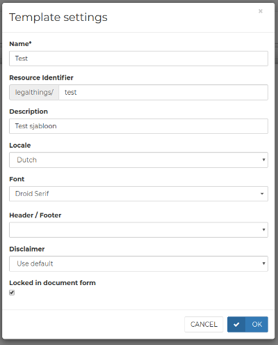

# Settings

Open the template setting by clicking this  icon when editing the template.

## Name and description

The name and description are returned when fetching a list of all templates. The name is also shown in the template overview.

## Reference

The template may be specified by its id, which automatically generated, or by the reference which is specified in the `Resource Identifier` field. Each template must have a unique reference. You can swap the reference from one template to another \(unlike an id\).

## Locale

The locale specifies the number and date formatting and typically should match the document language. Currently only Dutch and English are supported.

## Font

A single font is used throughout the document. Any font that's available through [Google fonts](https://fonts.google.com/) may be selected.

## Header / Footer

Use one of the header / footers when generating the PDF.

Note that the header and footer are not displayed when filling out the form or when getting the document as HTML.

## Categories

Categories can be linked to agreements so that the agreements can easily be found by the user on the website. A category consists of a name and an icon. The code of an icon can be found on the website: [_https://design.google.com/icons/_](https://design.google.com/icons/). If an icon is clicked, the code can be seen. A pop-up with a code similar to this then appears at the bottom of the site: ‘&lt;i class="material-icons"&gt;**&\#xE84D**;&lt;/i&gt;’. The bold part of this is the code for the categories.

With the ‘+ New category’ button, a new category can be created, and with the ‘Update order’ button, you can adjust the order of categories in the website after dragging the categories.

### 

Folders are present for the overview of the template. The order in which the templates are shown does not matter for the programming/digitization of a template. The ‘+ New folder’ button to create a new folder is also found here, as well as the ‘Update order’ button for updating the order.

## Disclaimer

It is possible to set up a disclaimer that is shown to the user prior to drawing up the contracts. This disclaimer will look as follows:

